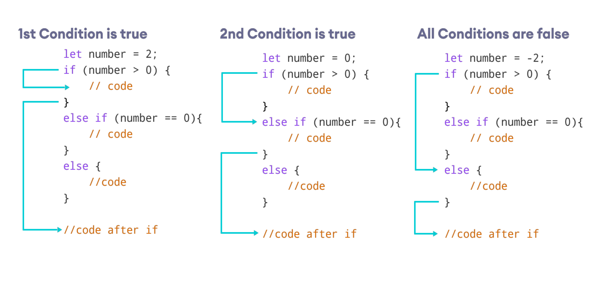
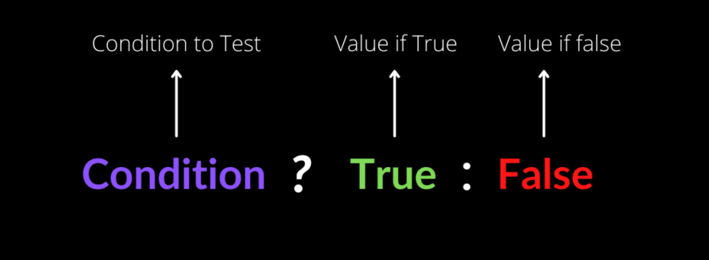
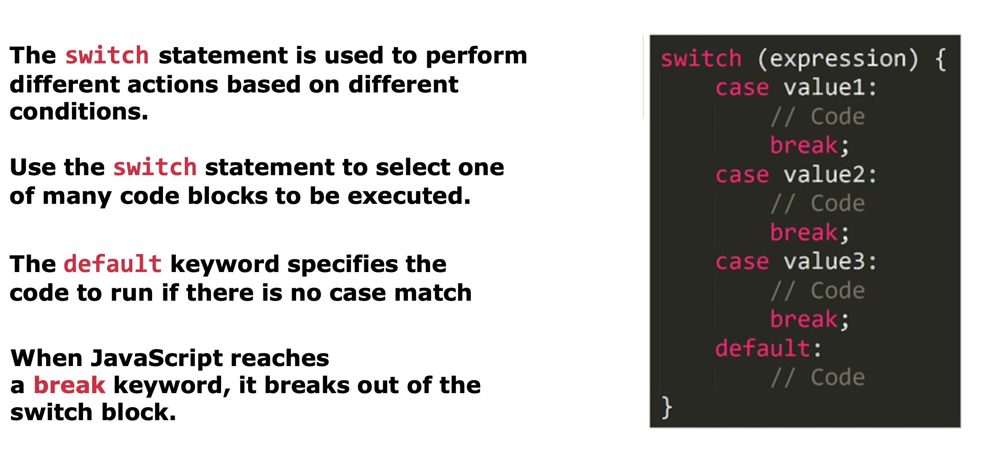

# LESSON 1      
## ***Java Script***
>  JavaScript  is a popular programming language that has a wide range of applications. 
JavaScript was previously used mainly for making webpages interactive such as form validation, animation, etc. Nowadays, JavaScript is also used in many other areas such as server-side development, mobile app development and so on.

##  A BRIEF HISTORY OF JAVASCRIPT
- 1995 - Brendan Eich creates the very first version of JavaScript in just 10 days. It was called Mocha;
- 1996 - Mocha changes to Live Script and then to Java Script;
- 1997 - With a need to standartize the language, ECMA releases ECMAScript 1 (ES1), the first official standart of JS;
- 2009 - ES5/ECMAScript 5 is realizrd with lots of great new features;
- 2015 - ES6/ECMAScript 2015 was realized the biggest update to the language ever
- 2016-till now - Release of ES2016 / ES2017 / ES2018 ...
 
## JS Variables
1. var - 
2. let -
3. const -

## JS Data Types
- Primitives
    1. Number
    2. String
    3. Boolean
    4. Undefined
    5. Null
    6. Symbol
    7. Bigint
    
- Object
    1. Object literal
    2. Arrays
    3. Functions
    4. Many more

# Condition
### Contition *if/else*

### Contition *ternary operator*

### Contition *swith statemant*
